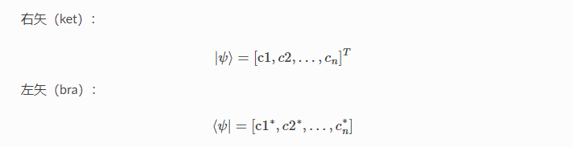
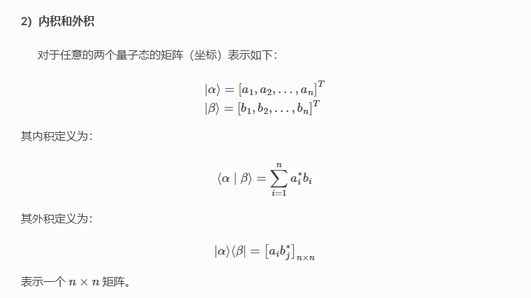
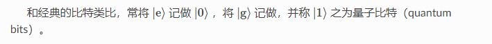
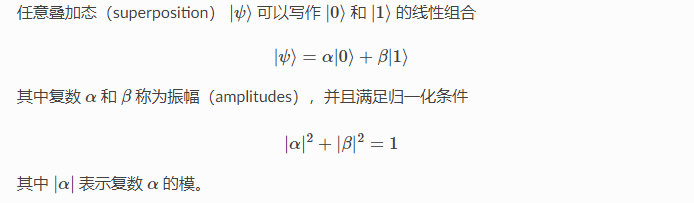
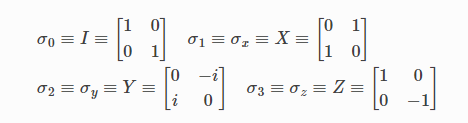
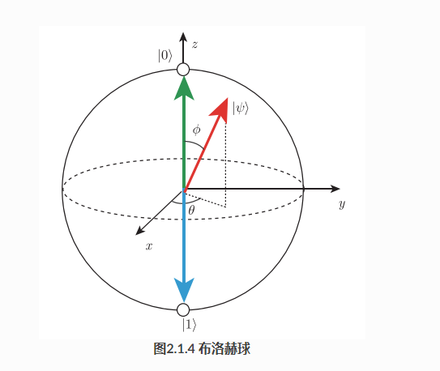
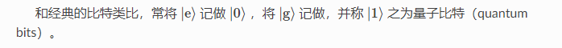
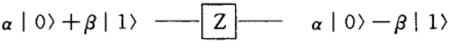
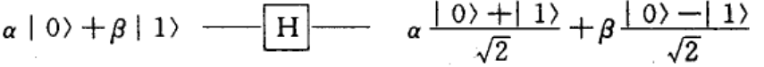
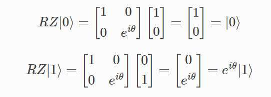

# 量子力学基础

### 问题

#### 问题一

这个是为什么(文中并没有给解释)

#### 问题二

复数i在Bloch球概率上的数学意义是什么？theta 又有什么意义？

#### 问题三

是否在测量后态量子态就坍缩到z轴上了？

我线代真心没学好啊！！！！！！

量子力学

简而言之，量子态就是一个微观粒子的状态。

啥，不可能

对于量子本身，它就是“同时存在”于很多状态的叠加上

a^2

量子比特存储更多信息，且其信息量随着量子比特增长指数级增长

如果量子态是一个纯态，那么它是球面上的点

Z:

H:

P(RZ):
$$
RZ|0> = |0> \\
RZ|1> = e^ i \theta |1>
$$
00>

10>

01>